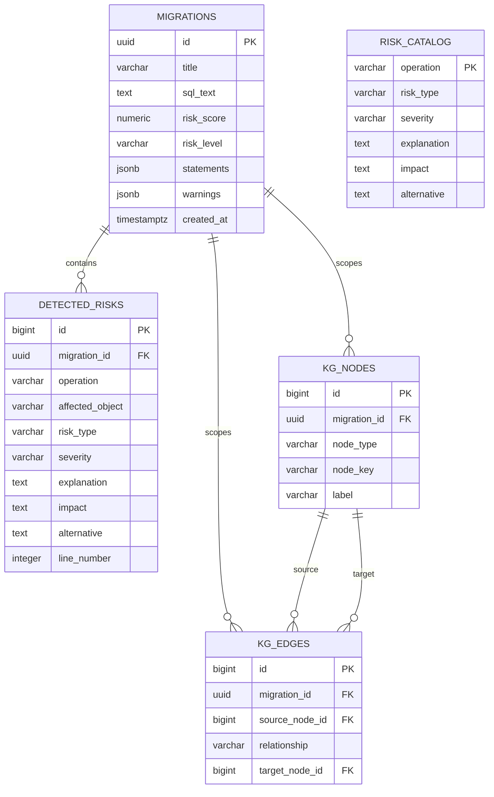
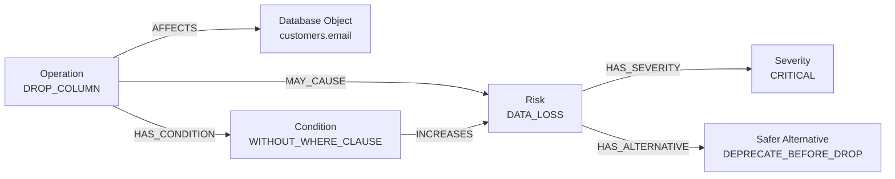
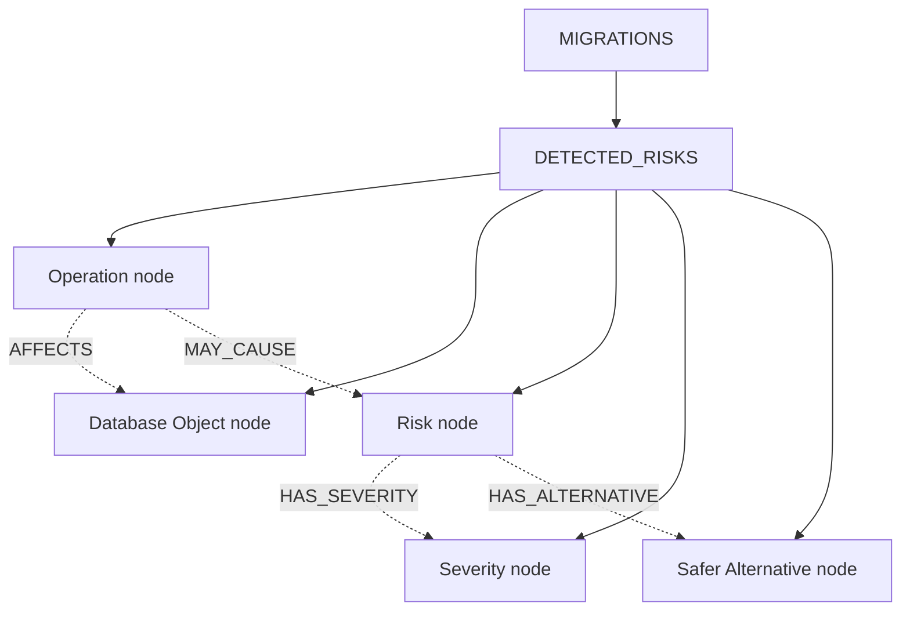

# Database Schema and Knowledge Graph

## Relational database schema

## Knowledge graph model

## Stored graph relationship flow

The `migration_id` on graph nodes and edges keeps each visualization scoped to one analyzed migration. The `risk_catalog` table is the reusable reference catalog; `detected_risks` stores the findings generated for an individual migration.
